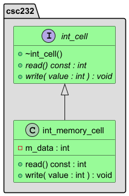
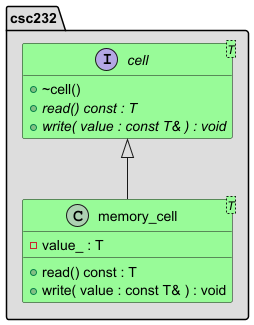

# Lectures

## Lecture 2

will become

## Disclaimer & Fair Use Statement

This repository may contain copyrighted material, the use of which may not
have been specifically authorized by the copyright owner. This material is
available in an effort to explain issues relevant to the course or to
illustrate the use and benefits of an educational tool. The material
contained in this repository is distributed without profit for research and
educational purposes. Only small portions of the original work are being
used and those could not be used to easily duplicate the original work.
