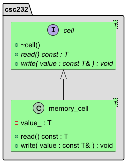

# Lecture 2 - C++ Classes

In today's lecture, the following design

will become this design

## Reading

From the Carrano & Henry textbook,

* [Chapter 2 Bags](https://msu.vitalsource.com/reader/books/9780138122782/epubcfi/6/62%5B%3Bvnd.vst.idref%3DP7001018341000000000000000000CEA%5D!/4/2%5BP7001018341000000000000000000CEA%5D/2/2%5BP7001018341000000000000000000CEB%5D/7:0%5B%2CBag%5D)
* [Chapter 3 Array-based Implementations](https://msu.vitalsource.com/reader/books/9780138122782/epubcfi/6/74%5B%3Bvnd.vst.idref%3DP7001018341000000000000000000EC1%5D!/4/2%5BP7001018341000000000000000000EC1%5D/2/2%5BP7001018341000000000000000000EC2%5D/7:0%5B%2C%20Ar%5D)

From the Weiss textbook,

* &sect;1.4 C++ Classes
* &sect;1.5 C++ Details
* &sect;1.6 Templates
* Appendix A Separate Compilation of Class Templates
